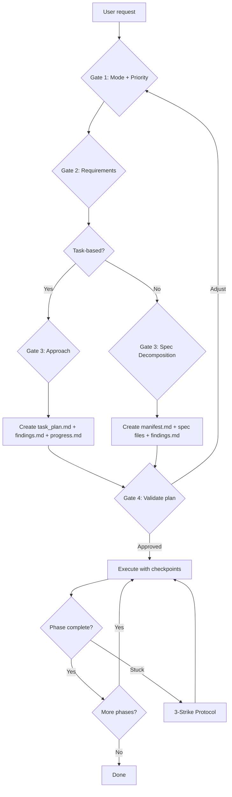

# interactive-planning

A Claude Code plugin that turns complex tasks into structured plans before you write a line of code.

Two modes: **task-based** for straightforward features, **spec-driven** for multi-domain work with dependency tracking.

## Contents

- [How it works](#how-it-works)
- [Install](#install)
- [Usage](#usage)
- [Planning modes](#planning-modes)
- [What's in the box](#whats-in-the-box)
- [Key concepts](#key-concepts)
- [Gate flow](#gate-flow)

## How it works

```
You: "Add a notification system with email, push, and in-app"

Claude asks:                          You answer:
  What kind of planning? ---------> Spec-driven
  Which priority? ----------------> Speed
  These requirements right? ------> [picks 3, adds 1]
  This spec breakdown ok? --------> Looks good

Claude creates:
  docs/plans/manifest.md          <- dependency graph, phase/sprint map
  docs/plans/specs/email-spec.md  <- requirements, tasks, acceptance criteria
  docs/plans/specs/push-spec.md
  docs/plans/specs/inapp-spec.md
  + TaskCreate entries with blocking dependencies wired up
```

Then you build phase by phase, with checkpoints at every transition.

## Install

```bash
/plugin marketplace add shihwesley/shihwesley-plugins
/plugin install interactive-planning @shihwesley-plugins
```

## Usage

### Start planning

```
/interactive-planning
```

Walks you through 4 interactive gates:
1. **Mode + Priority** — task-based or spec-driven? Speed or quality?
2. **Requirements** — validates inferred requirements against your intent
3. **Approach** — presents tradeoffs, you pick (or spec decomposition in spec-driven mode)
4. **Validation** — shows the full plan with tasks, you approve or adjust

### Check status

```
/interactive-planning status
```

Shows current phase, completed tasks, and what's next.

### Resume a session

```
/interactive-planning resume
```

Picks up where you left off. Reads planning files, checks git diff, finds the next unblocked task.

### Reset

```
/interactive-planning reset
```

Removes planning files (with confirmation). Asks if you want to keep findings.md.

### Auto-detection

The `planning-advisor` agent watches for complex tasks (3+ files, ambiguous requirements, cross-cutting concerns) and suggests planning. It never auto-starts -- just a nudge.

A SessionStart hook checks for existing planning files and alerts you if a previous session is in progress.

## Planning modes

### Task-based

Creates `task_plan.md`, `findings.md`, `progress.md` in your project root. Phases are sequential with TaskCreate blocking dependencies.

Good for: single features, bug investigations, refactors with clear scope.

### Spec-driven

Creates `docs/plans/manifest.md` with a dependency DAG (Mermaid) and individual spec files in `docs/plans/specs/`. Each spec has requirements, acceptance criteria, tasks, and dependency declarations.

Phases and sprints are auto-computed via topological sort. Two-level task tracking: spec-level parents with sub-tasks, intra-spec sequential blocking, and inter-spec handoff rules.

Good for: multi-domain features, large refactors, anything where separate concerns need their own requirements documents.

## What's in the box

| Component | File | Purpose |
|-----------|------|---------|
| Skill | `skills/interactive-planning/SKILL.md` | Core planning methodology |
| Templates | `skills/interactive-planning/templates/` | Manifest and spec file templates |
| Command | `commands/interactive-planning.md` | `/interactive-planning` with subcommands |
| Agent | `agents/planning-advisor.md` | Auto-detect complex tasks |
| Hook | `hooks/hooks.json` | SessionStart file detection |

## Key concepts

**Gates before tasks** — Every decision goes through an AskUserQuestion gate. No assumptions.

**Tasks before code** — All phases exist as TaskCreate entries before any implementation starts.

**2-Action Rule** — After every 2 search/browse operations, write findings to findings.md immediately.

**3-Strike Protocol** — Three attempts at a failing approach, then escalate to the user.

**Dependency DAG** (spec-driven) — Specs declare what they need from upstream and what they provide downstream. Sprint grouping is computed automatically.

## Gate flow



## License

MIT
