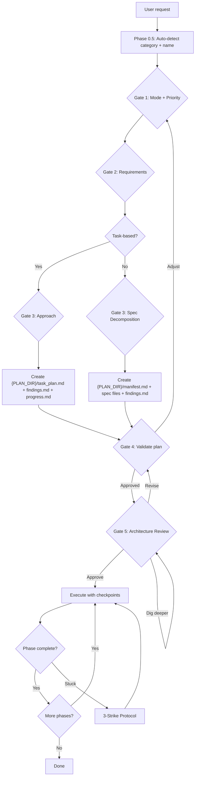

# interactive-planning

A Claude Code plugin that turns complex tasks into structured plans before you write a line of code.

Two modes: **task-based** for straightforward features, **spec-driven** for multi-domain work with dependency tracking. Plans are categorized by type and stored in separate directories so multiple plans can coexist.

## Contents

- [What's new in v5.0.0](#whats-new-in-v500)
- [How it works](#how-it-works)
- [Install](#install)
- [Usage](#usage)
- [Planning modes](#planning-modes)
- [Plan categories](#plan-categories)
- [What's in the box](#whats-in-the-box)
- [Key concepts](#key-concepts)
- [Gate flow](#gate-flow)

## What's new in v5.0.0

**Categorized plan directories** — plans now live in `docs/plans/{category}/{name}/` instead of a flat `docs/plans/`. Multiple planning sessions coexist without overwriting each other.

7 categories, auto-detected from your request:

| Category | Triggers on |
|----------|------------|
| `feat` | New functionality (default) |
| `fix` | Bugs, crashes, errors |
| `refactor` | Restructuring, migrations |
| `review` | Audits, evaluations |
| `test` | Test strategy, coverage |
| `polish` | UI/UX, performance, accessibility |
| `general` | Whole-app architecture |

No extra gate question — the category is inferred from what you ask for. You can override via "Other" at Gate 1.

```
You: "Plan the authentication system"
→ Auto-detected: feat/auth-system
→ Directory: docs/plans/feat/auth-system/

You: "Fix the login crash on iOS 18"
→ Auto-detected: fix/login-crash-ios18
→ Directory: docs/plans/fix/login-crash-ios18/
```

Commands now target specific plans:

```
/interactive-planning resume feat/auth-system
/interactive-planning status fix/login-crash
/interactive-planning list
```

`/orchestrate docs/plans/feat/auth-system` works with zero config — the plan ingester finds `manifest.md` or `task_plan.md` in whatever directory you point it at.

Legacy plans (flat `docs/plans/` or root-level files) are still detected and resumable.

### Previous: v4.2.0

**Gate 5: Architecture Review** — a mandatory review step between plan validation and execution. Before any code gets written, the plan is evaluated across 8 dimensions:

| Dimension | What it catches |
|-----------|----------------|
| System design & boundaries | Responsibility leaks, shotgun surgery |
| Dependency graph & coupling | Cascading changes, circular deps |
| Data flow & bottlenecks | Hot paths, unnecessary copies |
| Scaling & SPOFs | What breaks at 10x/100x |
| Security architecture | Auth gaps, leaky API surfaces |
| Error handling & failure modes | Recovery vs crash, graceful degradation |
| Testability | Hidden runtime deps, isolation problems |
| Existing codebase fit | Pattern conflicts, maintenance tax |

Every finding includes concrete tradeoffs, an opinionated recommendation, and a user input gate before assuming direction.

## How it works

```
You: "Add a notification system with email, push, and in-app"

Auto-detected: feat/notification-system

Claude asks:                          You answer:
  What kind of planning? ---------> Spec-driven
  Which priority? ----------------> Speed
  These requirements right? ------> [picks 3, adds 1]
  This spec breakdown ok? --------> Looks good

Claude creates:
  docs/plans/feat/notification-system/
    manifest.md                     <- dependency graph, phase/sprint map
    specs/email-spec.md             <- requirements, tasks, acceptance criteria
    specs/push-spec.md
    specs/inapp-spec.md
    findings.md                     <- decisions, research
    progress.md                     <- session log, reboot check
  + TaskCreate entries with blocking dependencies wired up
```

Then you build phase by phase, with checkpoints at every transition.

## Install

```bash
/plugin marketplace add shihwesley/shihwesley-plugins
/plugin install interactive-planning@shihwesley-plugins
```

## Usage

### Start planning

```
/interactive-planning
```

Auto-detects category and name from your request, then walks you through interactive gates:
1. **Mode + Priority** — task-based or spec-driven? Speed or quality? (shows detected category/name)
2. **Requirements** — validates inferred requirements against your intent
3. **Approach** — presents tradeoffs, you pick (or spec decomposition in spec-driven mode)
4. **Validation** — shows the full plan with tasks, you approve or adjust
5. **Architecture Review** — 8-dimension review before any code gets written

### Check status

```
/interactive-planning status                  # all plans
/interactive-planning status feat/auth        # specific plan
```

Shows current phase, completed tasks, and what's next. With multiple plans, displays a summary table.

### Resume a session

```
/interactive-planning resume                  # single plan or pick from list
/interactive-planning resume feat/auth        # specific plan
```

Picks up where you left off. Reads planning files, checks git diff, finds the next unblocked task.

### List all plans

```
/interactive-planning list
```

Table of all active plans with mode, category, and status.

### Reset

```
/interactive-planning reset                   # pick which to reset
/interactive-planning reset feat/auth         # specific plan
```

Removes plan directory (with confirmation). Asks if you want to keep findings.md.

### Auto-detection

The `planning-advisor` agent watches for complex tasks (3+ files, ambiguous requirements, cross-cutting concerns) and suggests planning with a likely category. It never auto-starts — just a nudge.

A SessionStart hook scans for existing plans across all categories and alerts you if sessions are in progress.

## Planning modes

### Task-based

Creates `task_plan.md`, `findings.md`, `progress.md` in the plan directory (`docs/plans/{category}/{name}/`). Phases are sequential with TaskCreate blocking dependencies.

Good for: single features, bug investigations, refactors with clear scope.

### Spec-driven

Creates `manifest.md` with a dependency DAG (Mermaid) and individual spec files in `specs/`. Each spec has requirements, acceptance criteria, tasks, and dependency declarations.

Phases and sprints are auto-computed via topological sort. Two-level task tracking: spec-level parents with sub-tasks, intra-spec sequential blocking, and inter-spec handoff rules.

Good for: multi-domain features, large refactors, anything where separate concerns need their own requirements documents.

## Plan categories

Plans are organized as `docs/plans/{category}/{name}/`:

```
docs/plans/
  feat/auth-system/         # new feature
    manifest.md
    specs/
    findings.md
    progress.md
  fix/login-crash/          # bug fix
    task_plan.md
    findings.md
    progress.md
  general/app-architecture/ # whole-app planning
    manifest.md
    specs/
    findings.md
    progress.md
```

Category is auto-detected from your request. Override anytime via "Other" at Gate 1.

Each plan is self-contained — `findings.md` and `progress.md` live inside the plan directory, not at project root. This means you can have a general architecture plan and a feature plan running side by side.

`/orchestrate` targets any plan directory directly: `/orchestrate docs/plans/feat/auth-system`.

## What's in the box

| Component | File | Purpose |
|-----------|------|---------|
| Skill | `skills/interactive-planning/SKILL.md` | Core planning methodology |
| Templates | `skills/interactive-planning/templates/` | Manifest and spec file templates |
| Command | `commands/interactive-planning.md` | `/interactive-planning` with subcommands |
| Agent | `agents/planning-advisor.md` | Auto-detect complex tasks |
| Hook | `hooks/hooks.json` | SessionStart plan detection |

## Key concepts

**Gates before tasks** — Every decision goes through an AskUserQuestion gate. No assumptions.

**Tasks before code** — All phases exist as TaskCreate entries before any implementation starts.

**Review before code** — Gate 5 (Architecture Review) runs after plan validation. No implementation until the architecture clears review.

**Auto-detect, don't ask** — Category and plan name are inferred from your request. No extra gate question.

**Plans are isolated** — Each plan lives in its own directory. Multiple plans coexist without conflict.

**2-Action Rule** — After every 2 search/browse operations, write findings to findings.md immediately.

**3-Strike Protocol** — Three attempts at a failing approach, then escalate to the user.

**Dependency DAG** (spec-driven) — Specs declare what they need from upstream and what they provide downstream. Sprint grouping is computed automatically.

## Gate flow


```mermaid
flowchart TD
    A[User request] --> A1[Phase 0.5: Auto-detect category + name]
    A1 --> B{Gate 1: Mode + Priority}
    B --> C{Gate 2: Requirements}
    C --> D{Task-based?}
    D -->|Yes| E{Gate 3: Approach}
    D -->|No| F{Gate 3: Spec Decomposition}
    E --> G["Create {PLAN_DIR}/task_plan.md + findings.md + progress.md"]
    F --> H["Create {PLAN_DIR}/manifest.md + spec files + findings.md"]
    G --> I{Gate 4: Validate plan}
    H --> I
    I -->|Adjust| B
    I -->|Approved| P{Gate 5: Architecture Review}
    P -->|Approve| J[Execute with checkpoints]
    P -->|Revise| I
    P -->|Dig deeper| P
    J --> K{Phase complete?}
    K -->|Yes| L{More phases?}
    K -->|Stuck| M[3-Strike Protocol]
    L -->|Yes| J
    L -->|No| N[Done]
    M --> J
```

## License

MIT
