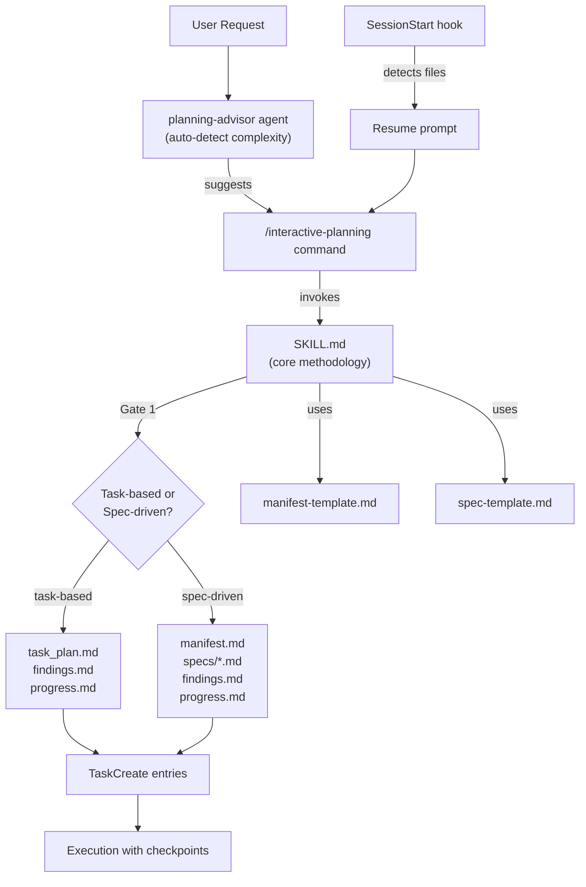
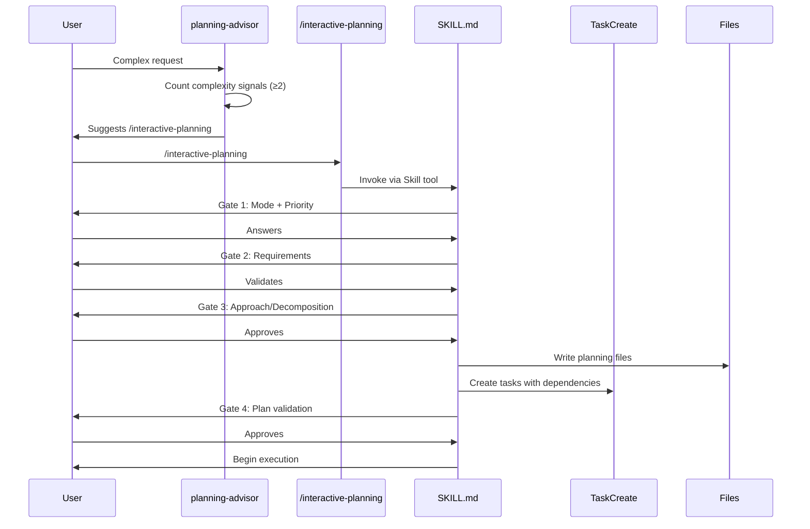
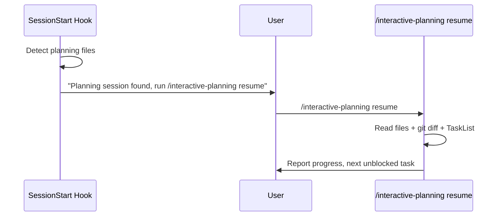

# Codebase Map

> Auto-generated by Mercator AI. Last mapped: 2026-02-13T19:44:53Z

## System Overview

A Claude Code plugin that adds file-based interactive planning with gate-driven user alignment. Two modes: task-based (single plan file, sequential phases) and spec-driven (multi-file specs with dependency DAG, topological sprint assignment). Uses `AskUserQuestion` for gates, `TaskCreate`/`TaskUpdate` for progress tracking, and Manus-style file persistence for knowledge retention across sessions.



## Directory Structure

```
interactive-planning/
├── .claude-plugin/
│   └── plugin.json           # Marketplace metadata (v4.1.0)
├── agents/
│   └── planning-advisor.md   # Read-only agent: complexity detection
├── commands/
│   └── interactive-planning.md  # Slash command router (start/status/resume/reset)
├── hooks/
│   ├── hooks.json            # SessionStart hook registration
│   └── scripts/
│       └── detect-planning-files.sh  # Detects existing plans on session start
├── skills/
│   └── interactive-planning/
│       ├── SKILL.md           # Core planning methodology (3523 tokens)
│       └── templates/
│           ├── manifest-template.md  # Spec-driven: manifest structure
│           └── spec-template.md      # Spec-driven: per-spec structure
├── .gitignore                # Excludes planning output artifacts
├── CHANGELOG.md              # v4.1.0 initial plugin release
├── LICENSE                   # MIT, Wesley Shih
└── README.md                 # Usage docs, examples, install
```

## Module Guide

### Plugin Registration

**Purpose**: Defines plugin identity for the Claude Code marketplace.
**Entry point**: `.claude-plugin/plugin.json`

| File | Purpose | Tokens |
|------|---------|--------|
| `.claude-plugin/plugin.json` | Name, version, author, keywords, description | 252 |

**Key fields**: name (`interactive-planning`), version (`4.1.0`), author (Wesley Shih)
**Dependencies**: None (pure metadata)
**Dependents**: Claude Code plugin loader

---

### Planning Advisor Agent

**Purpose**: Auto-detects complex user requests and nudges toward `/interactive-planning`.
**Entry point**: `agents/planning-advisor.md`

| File | Purpose | Tokens |
|------|---------|--------|
| `agents/planning-advisor.md` | Complexity detection + suggestion agent | 687 |

**Tools**: Read, Glob, TaskList (read-only)
**Model**: haiku (cheap, fast)
**Trigger threshold**: 2+ complexity signals (3+ files, ambiguous reqs, multiple architectures, cross-cutting concerns, user uncertainty phrases)
**Dependencies**: Reads `task_plan.md`, `findings.md`, `docs/plans/manifest.md` to check for existing sessions
**Dependents**: None (advisory only, never modifies state)

---

### Command Router

**Purpose**: Handles `/interactive-planning [start|status|resume|reset]` subcommands.
**Entry point**: `commands/interactive-planning.md`

| File | Purpose | Tokens |
|------|---------|--------|
| `commands/interactive-planning.md` | Slash command routing + subcommand logic | 670 |

**Subcommands**:
- `(none)` / `start` / `new` → invokes SKILL.md via Skill tool
- `status` → reads planning files + TaskList, reports progress
- `resume` → reads files + git diff, finds next unblocked task
- `reset` → AskUserQuestion confirmation, deletes planning files (NOT tasks)

**Dependencies**: SKILL.md, planning output files, TaskList
**Dependents**: User-facing entry point; planning-advisor suggests this command

---

### Core Skill (Heart of the Plugin)

**Purpose**: Full planning methodology — gates, file creation, execution protocols.
**Entry point**: `skills/interactive-planning/SKILL.md`

| File | Purpose | Tokens |
|------|---------|--------|
| `skills/interactive-planning/SKILL.md` | Planning methodology, gates, execution rules | 3523 |
| `skills/interactive-planning/templates/manifest-template.md` | Spec-driven manifest structure | 169 |
| `skills/interactive-planning/templates/spec-template.md` | Per-spec file structure | 241 |

**Phases**:
- Phase 0: Session recovery (check existing files)
- Phase 1: Interactive requirements (Gates 1–3)
- Phase 2: Create tasks and files
- Phase 3: Execution with checkpoints

**Gates** (all via AskUserQuestion):
1. Mode + Priority selection
2. Requirements validation (multi-select)
3. Approach (task-based) or Spec Decomposition (spec-driven)
4. Plan validation (show TaskList, approve/adjust)

**Execution protocols**:
- 2-Action Rule: write findings after every 2 search/browse ops
- 3-Strike Protocol: 3 attempts then escalate
- Manual checkpoints: phase completion, unexpected complexity, errors, scope creep

**Dependencies**: Templates, TaskCreate/TaskUpdate/AskUserQuestion tools
**Dependents**: Command router invokes this via Skill tool

---

### Session Hook

**Purpose**: Detects existing planning files on session start, prompts resume.
**Entry point**: `hooks/hooks.json` → `hooks/scripts/detect-planning-files.sh`

| File | Purpose | Tokens |
|------|---------|--------|
| `hooks/hooks.json` | SessionStart hook registration | 87 |
| `hooks/scripts/detect-planning-files.sh` | File detection + systemMessage output | 425 |

**Behavior**: Checks for `task_plan.md`, `findings.md`, `progress.md`, `docs/plans/manifest.md`. If found, outputs mode, file count, current phase, and suggests `/interactive-planning resume`.
**Timeout**: 5 seconds
**Matcher**: `*` (all projects)
**Dependencies**: `CLAUDE_PROJECT_DIR` env var (falls back to cwd)
**Dependents**: Runs automatically on every session start

## Data Flow

### Starting a New Plan



### Session Resume



## Conventions

- **File persistence over context**: Research goes in `findings.md`, not task descriptions
- **Gates before tasks**: Every decision through AskUserQuestion before creating TaskCreate entries
- **Tasks before code**: All phases materialized as tasks before implementation starts
- **Sub-task naming**: Prefixed with spec name (`data-model: Create schema`) for flat-list readability
- **Two-level task hierarchy** (spec-driven): Parent spec tasks for DAG, sub-tasks for actual work
- **Handoff rule**: Downstream spec's first sub-task blocked by upstream spec's LAST sub-task

## Gotchas

1. **Session recovery runs first** — Phase 0 checks for existing files before any gates fire
2. **Reset doesn't clear TaskList** — only removes planning files; tasks remain
3. **planning-advisor is read-only** — only Read, Glob, TaskList tools; cannot modify anything
4. **Inter-spec blocking targets the last sub-task**, not the parent — prevents premature downstream starts
5. **Parent task completion** is derived — only marked `completed` when ALL sub-tasks finish
6. **Sprint assignment is auto-computed** via topological sort but user can override at Gate 4
7. **Open Questions in specs trigger actual checkpoints**, not just documentation
8. **.gitignore excludes planning OUTPUT** (task_plan.md, etc.) — these are test artifacts in the plugin repo, but meaningful in user projects
9. **2-Action Rule matters for multimodal** — screenshots don't persist in context, so immediate capture is critical

## Navigation Guide

**To understand the planning methodology**: Read `skills/interactive-planning/SKILL.md` — it's the single source of truth
**To change the slash command behavior**: Edit `commands/interactive-planning.md`
**To adjust complexity detection thresholds**: Edit `agents/planning-advisor.md` (look for "Complexity Signals")
**To modify spec/manifest file structure**: Edit templates in `skills/interactive-planning/templates/`
**To change session detection behavior**: Edit `hooks/scripts/detect-planning-files.sh`
**To update marketplace metadata**: Edit `.claude-plugin/plugin.json`
