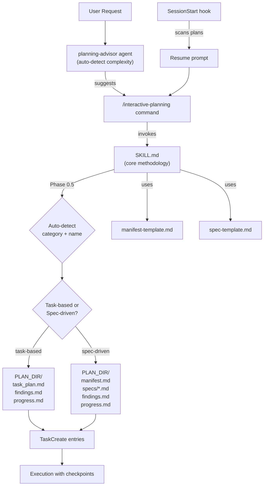
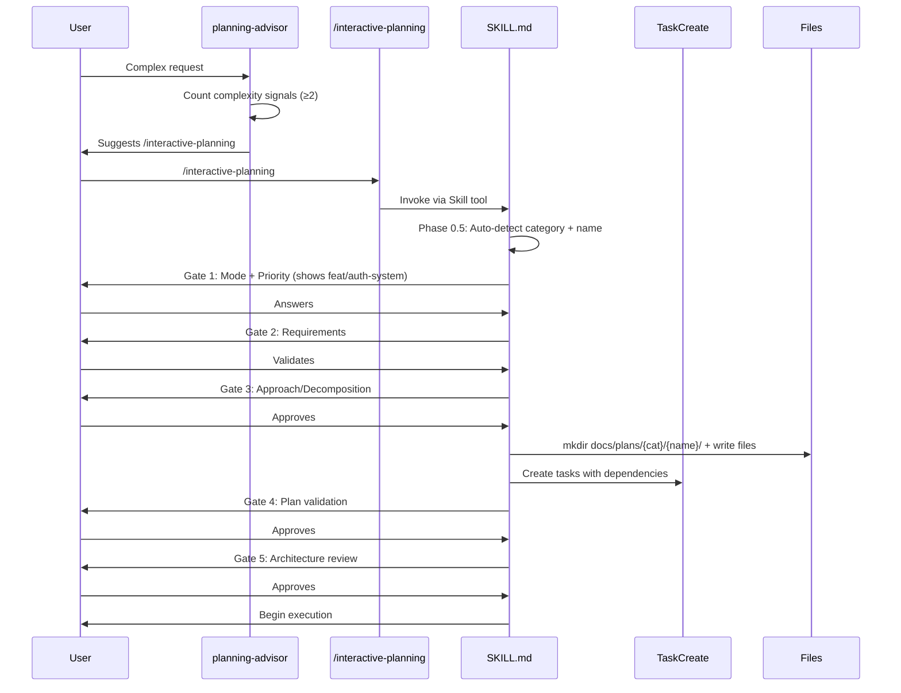
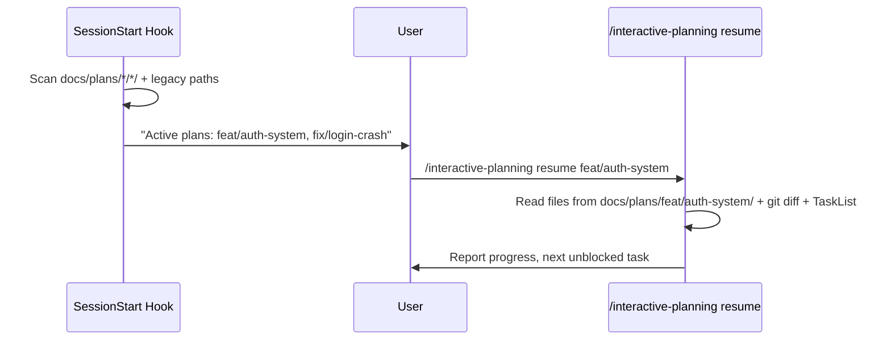

# Codebase Map

> Auto-generated by Mercator AI. Last mapped: 2026-03-03T00:00:00Z

## System Overview

A Claude Code plugin that adds file-based interactive planning with gate-driven user alignment. Two modes: task-based (single plan file, sequential phases) and spec-driven (multi-file specs with dependency DAG, topological sprint assignment). Plans are categorized by type (`feat`, `fix`, `refactor`, `review`, `test`, `polish`, `general`) and stored in `docs/plans/{category}/{name}/` for multi-plan coexistence. Category is auto-detected from user input. Uses `AskUserQuestion` for gates, `TaskCreate`/`TaskUpdate` for progress tracking, and Manus-style file persistence for knowledge retention across sessions.


```mermaid
graph TD
    User["User Request"] --> Advisor["planning-advisor agent<br/>(auto-detect complexity)"]
    Advisor -->|suggests| Cmd["/interactive-planning command"]
    Cmd -->|invokes| Skill["SKILL.md<br/>(core methodology)"]
    Skill -->|Phase 0.5| AutoDetect{"Auto-detect<br/>category + name"}
    AutoDetect --> Mode{"Task-based or<br/>Spec-driven?"}
    Mode -->|task-based| TaskFiles["PLAN_DIR/<br/>task_plan.md<br/>findings.md<br/>progress.md"]
    Mode -->|spec-driven| SpecFiles["PLAN_DIR/<br/>manifest.md<br/>specs/*.md<br/>findings.md<br/>progress.md"]
    TaskFiles --> Tasks["TaskCreate entries"]
    SpecFiles --> Tasks
    Tasks --> Exec["Execution with checkpoints"]
    Hook["SessionStart hook"] -->|scans plans| Resume["Resume prompt"]
    Resume --> Cmd

    Skill -->|uses| ManifestTpl["manifest-template.md"]
    Skill -->|uses| SpecTpl["spec-template.md"]
```

**Plan directory layout:**
```
docs/plans/
  {category}/{name}/     # e.g. feat/auth-system/
    manifest.md          # (spec-driven) or task_plan.md (task-based)
    specs/               # (spec-driven only)
    findings.md
    progress.md
```

## Directory Structure

```
interactive-planning/
├── .claude-plugin/
│   └── plugin.json           # Marketplace metadata (v5.0.0)
├── agents/
│   └── planning-advisor.md   # Read-only agent: complexity detection
├── commands/
│   └── interactive-planning.md  # Slash command router (start/status/resume/reset/list)
├── hooks/
│   ├── hooks.json            # SessionStart hook registration
│   └── scripts/
│       └── detect-planning-files.sh  # Detects existing plans on session start
├── skills/
│   └── interactive-planning/
│       ├── SKILL.md           # Core planning methodology
│       └── templates/
│           ├── manifest-template.md  # Spec-driven: manifest structure
│           └── spec-template.md      # Spec-driven: per-spec structure
├── .gitignore                # Excludes planning output artifacts
├── CHANGELOG.md
├── LICENSE                   # MIT, Wesley Shih
└── README.md                 # Usage docs, examples, install
```

## Module Guide

### Plugin Registration

**Purpose**: Defines plugin identity for the Claude Code marketplace.
**Entry point**: `.claude-plugin/plugin.json`

| File | Purpose | Tokens |
|------|---------|--------|
| `.claude-plugin/plugin.json` | Name, version, author, keywords, description | 280 |

**Key fields**: name (`interactive-planning`), version (`5.0.0`), author (Wesley Shih)
**Dependencies**: None (pure metadata)
**Dependents**: Claude Code plugin loader

---

### Planning Advisor Agent

**Purpose**: Auto-detects complex user requests and nudges toward `/interactive-planning`.
**Entry point**: `agents/planning-advisor.md`

| File | Purpose | Tokens |
|------|---------|--------|
| `agents/planning-advisor.md` | Complexity detection + suggestion agent | 720 |

**Tools**: Read, Glob, TaskList (read-only)
**Model**: haiku (cheap, fast)
**Trigger threshold**: 2+ complexity signals (3+ files, ambiguous reqs, multiple architectures, cross-cutting concerns, user uncertainty phrases)
**Dependencies**: Scans `docs/plans/*/*/manifest.md`, `docs/plans/*/*/task_plan.md`, plus legacy flat paths
**Dependents**: None (advisory only, never modifies state)

---

### Command Router

**Purpose**: Handles `/interactive-planning [start|status|resume|reset|list]` subcommands.
**Entry point**: `commands/interactive-planning.md`

| File | Purpose | Tokens |
|------|---------|--------|
| `commands/interactive-planning.md` | Slash command routing + subcommand logic | 1100 |

**Subcommands**:
- `(none)` / `start` / `new` → invokes SKILL.md via Skill tool
- `status [category/name]` → scans all plans or shows specific plan status
- `resume [category/name]` → resumes specific plan or asks which to resume
- `reset [category/name]` → AskUserQuestion confirmation, deletes plan directory (NOT tasks)
- `list` → table of all plans with mode, category, status

**Dependencies**: SKILL.md, planning output files, TaskList
**Dependents**: User-facing entry point; planning-advisor suggests this command

---

### Core Skill (Heart of the Plugin)

**Purpose**: Full planning methodology — auto-detection, gates, file creation, execution protocols.
**Entry point**: `skills/interactive-planning/SKILL.md`

| File | Purpose | Tokens |
|------|---------|--------|
| `skills/interactive-planning/SKILL.md` | Planning methodology, gates, execution rules | 4800 |
| `skills/interactive-planning/templates/manifest-template.md` | Spec-driven manifest structure (with category) | 200 |
| `skills/interactive-planning/templates/spec-template.md` | Per-spec file structure (with plan reference) | 260 |

**Phases**:
- Phase 0: Session recovery (scan `docs/plans/*/*/` for multi-plan resume)
- Phase 0.5: Auto-detect plan category + name from user's request
- Phase 1: Interactive requirements (Gates 1–3)
- Phase 2: Create plan directory, tasks, and files under `{PLAN_DIR}`
- Phase 3: Execution with checkpoints

**Gates** (all via AskUserQuestion):
1. Mode + Priority selection (shows auto-detected category/name)
2. Requirements validation (multi-select)
3. Approach (task-based) or Spec Decomposition (spec-driven)
4. Plan validation (show TaskList, approve/adjust)
5. Architecture review (8 dimensions, approve/revise/dig deeper)

**Auto-detection heuristics** (Phase 0.5):
- Keywords map to categories: fix/bug/crash → `fix`, test/coverage → `test`, refactor/migrate → `refactor`, review/audit → `review`, polish/perf/a11y → `polish`, architecture/scaffold → `general`, default → `feat`
- Plan name is slugified from key noun phrases

**Execution protocols**:
- 2-Action Rule: write findings after every 2 search/browse ops
- 3-Strike Protocol: 3 attempts then escalate
- Manual checkpoints: phase completion, unexpected complexity, errors, scope creep

**Dependencies**: Templates, TaskCreate/TaskUpdate/AskUserQuestion tools
**Dependents**: Command router invokes this via Skill tool

---

### Session Hook

**Purpose**: Detects existing planning files on session start, prompts resume.
**Entry point**: `hooks/hooks.json` → `hooks/scripts/detect-planning-files.sh`

| File | Purpose | Tokens |
|------|---------|--------|
| `hooks/hooks.json` | SessionStart hook registration | 87 |
| `hooks/scripts/detect-planning-files.sh` | Multi-plan detection + systemMessage output | 650 |

**Behavior**: Scans `docs/plans/*/*/` for categorized plans (v5+) and checks legacy flat paths (`task_plan.md`, `docs/plans/manifest.md`). Lists all found plans with categories, modes, and spec counts. Suggests `/interactive-planning resume`.
**Timeout**: 5 seconds
**Matcher**: `*` (all projects)
**Dependencies**: `CLAUDE_PROJECT_DIR` env var (falls back to cwd)
**Dependents**: Runs automatically on every session start

## Data Flow

### Starting a New Plan


```mermaid
sequenceDiagram
    participant U as User
    participant A as planning-advisor
    participant C as /interactive-planning
    participant S as SKILL.md
    participant T as TaskCreate
    participant F as Files

    U->>A: Complex request
    A->>A: Count complexity signals (≥2)
    A->>U: Suggests /interactive-planning
    U->>C: /interactive-planning
    C->>S: Invoke via Skill tool
    S->>S: Phase 0.5: Auto-detect category + name
    S->>U: Gate 1: Mode + Priority (shows feat/auth-system)
    U->>S: Answers
    S->>U: Gate 2: Requirements
    U->>S: Validates
    S->>U: Gate 3: Approach/Decomposition
    U->>S: Approves
    S->>F: mkdir docs/plans/{cat}/{name}/ + write files
    S->>T: Create tasks with dependencies
    S->>U: Gate 4: Plan validation
    U->>S: Approves
    S->>U: Gate 5: Architecture review
    U->>S: Approves
    S->>U: Begin execution
```

### Session Resume


```mermaid
sequenceDiagram
    participant H as SessionStart Hook
    participant U as User
    participant C as /interactive-planning resume

    H->>H: Scan docs/plans/*/*/ + legacy paths
    H->>U: "Active plans: feat/auth-system, fix/login-crash"
    U->>C: /interactive-planning resume feat/auth-system
    C->>C: Read files from docs/plans/feat/auth-system/ + git diff + TaskList
    C->>U: Report progress, next unblocked task
```

## Conventions

- **Categorized plan directories**: All plans live in `docs/plans/{category}/{name}/` — never at project root
- **Auto-detection over extra gates**: Category and name are inferred from user input, not asked
- **PLAN_DIR variable**: All file paths in SKILL.md use `{PLAN_DIR}`, never hardcoded paths
- **File persistence over context**: Research goes in `{PLAN_DIR}/findings.md`, not task descriptions
- **Gates before tasks**: Every decision through AskUserQuestion before creating TaskCreate entries
- **Tasks before code**: All phases materialized as tasks before implementation starts
- **Sub-task naming**: Prefixed with spec name (`data-model: Create schema`) for flat-list readability
- **Two-level task hierarchy** (spec-driven): Parent spec tasks for DAG, sub-tasks for actual work
- **Handoff rule**: Downstream spec's first sub-task blocked by upstream spec's LAST sub-task
- **Legacy compatibility**: Pre-v5 flat-path plans are detected and resumable without migration

## Gotchas

1. **Session recovery scans recursively** — Phase 0 uses `find` to locate all plans under `docs/plans/`
2. **Multiple plans can coexist** — each in its own `{category}/{name}/` directory
3. **Legacy plans are detected but not migrated** — flat-path plans from v4.x work in-place
4. **Reset doesn't clear TaskList** — only removes planning files; tasks remain
5. **planning-advisor is read-only** — only Read, Glob, TaskList tools; cannot modify anything
6. **Inter-spec blocking targets the last sub-task**, not the parent — prevents premature downstream starts
7. **Parent task completion** is derived — only marked `completed` when ALL sub-tasks finish
8. **Sprint assignment is auto-computed** via topological sort but user can override at Gate 4
9. **Open Questions in specs trigger actual checkpoints**, not just documentation
10. **.gitignore excludes planning OUTPUT** (task_plan.md, etc.) — these are test artifacts in the plugin repo, but meaningful in user projects
11. **2-Action Rule matters for multimodal** — screenshots don't persist in context, so immediate capture is critical
12. **`/orchestrate` integration is zero-config** — point it at any `docs/plans/{cat}/{name}/` directory and the ingester finds `manifest.md` or `task_plan.md` automatically

## Navigation Guide

**To understand the planning methodology**: Read `skills/interactive-planning/SKILL.md` — it's the single source of truth
**To change the slash command behavior**: Edit `commands/interactive-planning.md`
**To adjust complexity detection thresholds**: Edit `agents/planning-advisor.md` (look for "Complexity Signals")
**To modify spec/manifest file structure**: Edit templates in `skills/interactive-planning/templates/`
**To change session detection behavior**: Edit `hooks/scripts/detect-planning-files.sh`
**To update marketplace metadata**: Edit `.claude-plugin/plugin.json`
**To add new plan categories**: Update keyword table in SKILL.md Phase 0.5
